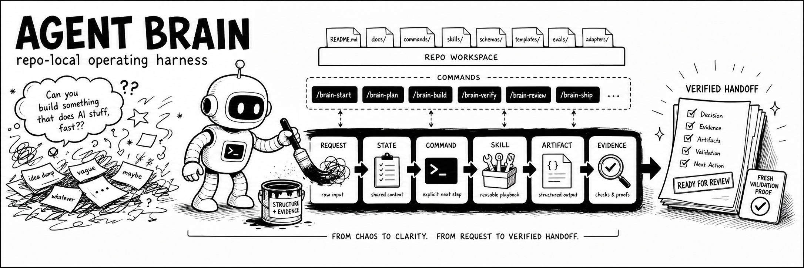
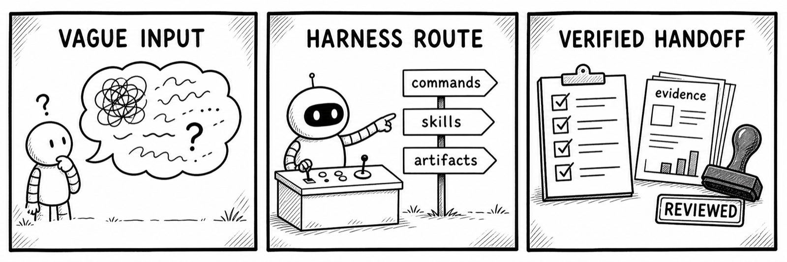
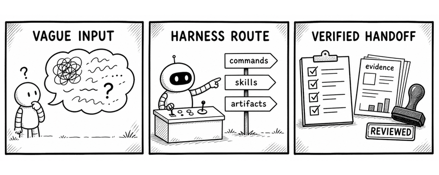
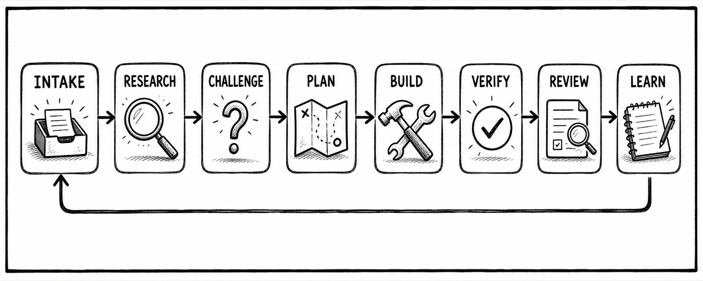
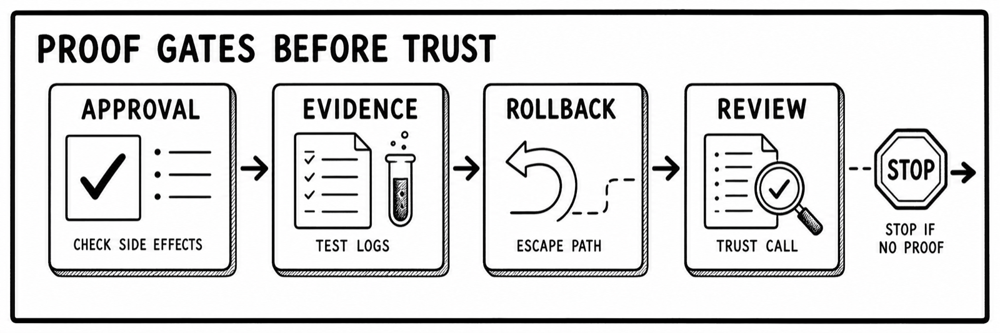

# Agent Brain

<p align="center">
  
</p>

<p align="center">
  <strong>Repo-local operating rules for coding agents.</strong><br>
  Commands, skills, schemas, templates, evals, and proof gates that make agent work inspectable.
</p>

<p align="center">
  <a href="https://github.com/rohitg00/agentbrain/actions/workflows/quality.yml"></a>
  <a href="https://github.com/rohitg00/agentbrain/blob/main/LICENSE"></a>
  <a href="https://github.com/rohitg00/agentbrain/stargazers"></a>
  
  
</p>

## Supported Agent Runtimes

<p align="center">
  <strong>Works with the coding agent you already use.</strong>
</p>

<table align="center">
  <tr>
    <td align="center" width="96">
      <a href="https://claude.ai/code">
        <br>
        <sub>Claude Code</sub>
      </a>
    </td>
    <td align="center" width="96">
      <a href="https://openai.com/codex/">
        <picture>
          <source media="(prefers-color-scheme: dark)" srcset="https://svgl.app/library/codex_dark.svg">
          
        </picture><br>
        <sub>Codex</sub>
      </a>
    </td>
    <td align="center" width="96">
      <a href="https://github.com/google-gemini/gemini-cli">
        <br>
        <sub>Gemini CLI</sub>
      </a>
    </td>
    <td align="center" width="96">
      <a href="https://www.cursor.com">
        <picture>
          <source media="(prefers-color-scheme: dark)" srcset="https://svgl.app/library/cursor_dark.svg">
          
        </picture><br>
        <sub>Cursor</sub>
      </a>
    </td>
    <td align="center" width="96">
      <a href="https://github.com/features/copilot">
        <picture>
          <source media="(prefers-color-scheme: dark)" srcset="https://svgl.app/library/copilot_dark.svg">
          
        </picture><br>
        <sub>Copilot</sub>
      </a>
    </td>
    <td align="center" width="96">
      <a href="https://windsurf.com/editor">
        <picture>
          <source media="(prefers-color-scheme: dark)" srcset="https://svgl.app/library/windsurf-dark.svg">
          
        </picture><br>
        <sub>Windsurf</sub>
      </a>
    </td>
    <td align="center" width="96">
      <a href="https://opencode.ai/">
        <picture>
          <source media="(prefers-color-scheme: dark)" srcset="https://svgl.app/library/opencode-dark.svg">
          
        </picture><br>
        <sub>OpenCode</sub>
      </a>
    </td>
    <td align="center" width="96">
      <a href="https://openclaw.ai/">
        <br>
        <sub>OpenClaw</sub>
      </a>
    </td>
    <td align="center" width="150">
      <a href="https://hermes-agent.nousresearch.com/">
        <br>
        <sub>Hermes</sub>
      </a>
    </td>
  </tr>
</table>

<p align="center">
  <sub>SVGL-hosted marks update in place where available; Hermes uses the repo-local Hermes-Agent logo.</sub>
</p>

<p align="center">
  <code>raw request</code> -&gt; <code>state</code> -&gt; <code>command</code> -&gt; <code>skill</code> -&gt; <code>artifact</code> -&gt; <code>evidence</code> -&gt; <code>handoff</code>
</p>

Agent Brain is a portable harness you add to a repository. It does not run your
agent. It gives any file-reading coding agent a state machine, command specs,
skills, schemas, evals, and handoff contracts so work moves through evidence,
artifacts, verification, review, and learning instead of chat momentum.

It is not a decorative prompt pack, an IDE plugin, or another agent framework.
Bring the coding agent you already use. Agent Brain supplies the operating
discipline around the model.

Use it when you want an agent to stop guessing, pick the right lifecycle state,
produce the right artifact, and prove the work before it claims progress.

Works with agent runtimes that can read files and follow repository-local
instructions: terminal coding agents, IDE agents, subagent runners,
approval-gated runtimes, and custom CLI or hosted agents.

Most agent failures are not syntax errors. They are judgment errors:

- building the wrong thing,
- trusting stale context,
- skipping tests,
- accepting vague requirements,
- shipping without rollback,
- turning one messy run into permanent memory.

Agent Brain keeps the first question sharp:

> Should this exist, should it be an agent, and what evidence would prove or kill it?

It gives agents three non-negotiable habits:

- **Plan before build.** Route vague requests through intake, research, challenge,
  brief, design, and plan before implementation.
- **Verify before trust.** Treat tests, logs, diffs, screenshots, citations, and
  approvals as proof; treat confident summaries as claims.
- **Learn only from evidence.** Turn repeated successful workflows into small,
  neutral skills without copying external branding or temporary task chatter.

## Quickstart

### Try it in any coding agent

Paste this into your agent:

```text
Use Agent Brain as your operating harness.

Clone https://github.com/rohitg00/agentbrain, read AGENTBRAIN.md, PRINCIPLES.md, ANTI_RATIONALIZATION.md, and docs/state-machine.md, then choose the command in commands/ that matches my request.

Do not build before evidence, plan, and verification are clear. Produce the required artifact from templates/ and schemas/. Stop if approval, secrets, loop limits, rollback, or validation evidence are missing.
```

Then give the agent a real request, for example:

```text
I want to build an agent that handles customer refunds. Use Agent Brain before planning implementation.
```

A good run should not jump to code. It should route through `/brain-start`, challenge whether an agent is appropriate, name the missing evidence, and produce a small artifact before any build work.

### Install native slash-command wrappers

For runtimes with project-local custom command support, generate thin wrappers from `commands/registry.json`:

```bash
python scripts/install_slash_commands.py --runtime <runtime-key>
```

The wrappers expose `/brain-*` shortcuts while keeping `commands/brain-*.md` as the source of truth. Runtimes without proven custom slash-command support should use `AGENTS.md` and the command registry directly.

### Run the local quality gate

Agent Brain is documentation-first, but it is still tested. Match CI with Python 3.11.

```bash
git clone https://github.com/rohitg00/agentbrain.git
cd agentbrain
python3 --version  # expect Python 3.11.x
python3 -m venv .venv
source .venv/bin/activate
python3 -m pip install -r requirements-dev.txt
rm -rf scripts/__pycache__ tests/__pycache__
python -m pytest -q
python scripts/validate_repo.py
git diff --check
git fetch origin main
git rev-parse HEAD
git rev-parse origin/main
```

Confirm `HEAD equals origin/main` before using a checkout as a trustworthy harness. Run baseline validation before editing so new failures are not blamed on old repository drift.

Expected result:

```text
all tests pass
Validation passed
no whitespace diff errors
```

If those commands do not pass, fix validation before handing the repo to an autonomous agent.

## What Agent Brain gives an agent

Agent Brain gives a capable model a way to operate like a careful teammate instead of a blank prompt box.

- **A constitution:** constructive disagreement, stop conditions, approval gates.
- **A lifecycle:** intake, research, challenge, decide, design, plan, build, verify, review, ship, learn.
- **Slash-command specs:** repeatable workflows such as `/brain-plan`, `/brain-review`, and `/brain-learn`.
- **Portable skills:** small procedures with triggers, inputs, steps, verification, examples, and failure modes.
- **Artifact contracts:** schemas and templates for briefs, plans, reviews, QA evidence, doctor reports, runtime smoke reports, scorecards, and handoffs.
- **Evals:** cases that catch common agent failures before they become habits.
- **Adapters:** guidance for runtimes that load markdown, skills, subagents, or approval-gated tools differently.

The repo is intentionally portable. It is not a hosted runtime, IDE plugin, or model wrapper. It is the operating discipline layer you put on top of the agent you already use.

<p align="center">
  
</p>

## When to use it

Use Agent Brain when the cost of a wrong agent action is higher than the cost of a few minutes of structure.

Good fits:

- planning a feature before implementation,
- reviewing agent-written code,
- turning a vague product idea into a real scope decision,
- checking whether automation should exist at all,
- collecting fresh proof before a handoff,
- converting repeated success or failure into a maintained skill,
- running agents in parallel without trusting their summaries blindly.

Bad fits:

- one-off toy prompts,
- simple deterministic scripts,
- tasks where a checklist or human approval queue is safer,
- work that needs a production runtime, queue, dashboard, or hosted memory backend by itself.

## See it work

<p align="center">
  
</p>

```text
User: Build an agent for customer refunds.

Agent Brain route:
/brain-start
  -> classify as high-risk automation
/brain-should-this-exist
  -> compare agent vs form vs checklist vs human approval queue
/brain-grill
  -> ask who approves refunds, what policy applies, and what abuse cases matter
/brain-brief
  -> write the smallest product scope with facts, assumptions, open questions, and kill criteria
/brain-plan
  -> only if the decision survives challenge
```

The useful answer might be: do not build an autonomous refund agent yet. Start with a policy-backed approval workflow and a read-only assistant. That is the point.

## The workflow

```text
raw request
  -> intake
  -> should this exist?
  -> research
  -> grill
  -> brief
  -> design
  -> plan
  -> build
  -> verify
  -> review
  -> ship
  -> learn
```

The loop can stop early. Stopping early is success when evidence shows the idea is unsafe, overbuilt, or not worth building.

<p align="center">
  
</p>

## Run as an Agent Harness

For the full operating contract, read `docs/agent-harness.md`.

A capable agent should follow this sequence:

```text
intake -> choose state -> load command -> load skill -> produce artifact -> verify -> review -> ship or learn
```

For coding work, the normal path is:

```text
request
-> /brain-start
-> /brain-should-this-exist when the problem is weak or over-automated
-> /brain-research when claims need sources
-> /brain-grill when assumptions are soft
-> /brain-brief when product scope is needed
-> /brain-design when flows and states matter
-> /brain-plan when implementation is ready
-> /brain-build only after evidence and plan exist
-> /brain-verify for tests and proof
-> /brain-review before trusting output
-> /brain-ship only with rollback and launch checks
-> /brain-learn after repeated success or failure
```

## Minimal Harness Prompt

Use this when you want another agent to apply Agent Brain precisely:

```text
You are working inside the Agent Brain repository.

Rules:
1. Start by reading AGENTBRAIN.md, PRINCIPLES.md, ANTI_RATIONALIZATION.md, and docs/state-machine.md.
2. Inspect git status --short and git log --oneline -5.
3. Run baseline validation before editing when the task changes repository files.
4. Preserve user changes. Never overwrite unrelated local work.
5. Choose the earliest safe lifecycle state, then load the matching command from commands/ and the required skills/.
6. Produce the required artifact using templates/ and schemas/.
7. Do not build before evidence, scope, and verification are clear.
8. Stop when approval, secrets handling, loop limits, rollback, or evidence are missing.
9. Before final output, run: rm -rf scripts/__pycache__ tests/__pycache__ && python -m pytest -q && python scripts/validate_repo.py && git diff --check.
10. If running as a noninteractive scheduled run, do not ask questions. Use the safest documented default only when ambiguity does not change scope, safety, side effects, or approval.
```

## Repository Map

```text
AGENTS.md                     # first-stop agent entrypoint
AGENTBRAIN.md                  # constitution and operating loop
INSTALL_FOR_AGENTS.md          # fresh-checkout setup path for agents
PRINCIPLES.md                  # behavioral principles
ANTI_RATIONALIZATION.md        # shortcut rebuttals
CONTRIBUTING.md                # contribution and validation workflow
requirements-dev.txt           # local validation dependencies
.github/workflows/             # CI quality gate
commands/                      # slash command specs
skills/                        # portable agent skills
schemas/                       # machine-checkable artifact schemas
examples/artifacts/            # valid JSON examples for schemas
docs/                          # architecture, state, memory, research, gates
templates/                     # artifact templates
evals/                         # cases and rubrics
adapters/                      # runtime-specific integration notes
scripts/                       # validation, doctor, scrub, and runtime smoke tooling
```

## Documentation Guide

Start here:

- `docs/agent-harness.md` — setup, operating loop, stop conditions, and troubleshooting.
- `docs/audience-playbooks.md` — entrypoints and proof gates for adopters, agents, maintainers, runtime builders, workflow authors, teams, reviewers, and session operators.
- `docs/drift-tracking.md` — deterministic extraction, structured diffs, and release-note synthesis for changing contracts.
- `docs/harness-effect.md` — why the harness layer changes agent behavior, operating rules for new tools, and parity checks across tool-output presentation modes.
- `docs/operation-contract.md` — read-only, write, approval-gated, side-effect, and destructive operation modes.
- `docs/replayable-evidence.md` — exact evidence chain needed to replay evals, runtime smoke, scorecards, and handoffs.
- `docs/state-machine.md` — valid states, transitions, required artifacts, and stop conditions.
- `docs/architecture.md` — repository architecture and validation responsibilities.
- `docs/review-gates.md` — product, design, engineering, security, QA, launch, and verifier gates.
- `docs/non-agent-alternatives.md` — when a script, checklist, form, queue, or human review is better.
- `docs/skill-system.md` — skill anatomy, lifecycle fit, catalog rules, and maintenance.
- `docs/skill-distillation.md` — turn external workflows into neutral skills without copying branding.
- `docs/memory-model.md` — what belongs in durable memory versus temporary task state.
- `docs/ci-recovery.md` — inspect, reproduce, fix, and re-check remote workflow failures.
- `docs/devex-engineering.md` — setup, validation, command routing, and recovery guidance.
- `docs/autonomous-goals.md` — scope long-running goals with measurable end states and loop limits.
- `docs/shared-language.md` — keep project terms, aliases, and naming conflicts explicit.
- `docs/slash-command-install.md` — native `/brain-*` wrapper generation for supported runtimes without turning Agent Brain into a service.
- `docs/runtime-lifecycle.md` — phase, queue, tool lifecycle, save-point, retry, abort, and compaction discipline.
- `docs/decision-records.md` — record durable trade-offs without turning chat into history.
- `docs/claims-we-reject.md` — claims and shortcuts the harness refuses without evidence.
- `docs/ecosystem-review.md` — neutral criteria for evaluating external patterns.
- `docs/grilling-protocol.md` — staged challenge process for weak assumptions.
- `docs/implementation-plan.md` — guidance for moving from plan to verified slices.
- `docs/implementation-roadmap.md` — checkpoint ledger for harness hardening.
- `docs/question-ladder.md` — ask staged questions without overwhelming the user.
- `docs/research-synthesis.md` — turn sources into operating principles.
- `docs/research-watchlist.md` — source classes to monitor while preserving neutral public copy.

## Core State Machine

```text
INTAKE
-> RESEARCH
-> CHALLENGE
-> DECIDE
-> DESIGN
-> PLAN
-> BUILD
-> VERIFY
-> REVIEW
-> SHIP
-> LEARN
```

Each state answers:

- What artifact is required?
- What evidence is needed?
- What could kill or redirect the work?
- What is the next valid state?
- What stop condition prevents unsafe progress?

## Command Selection Guide

Use this guide before reading individual command files. Pick the earliest safe lifecycle state that matches the request, especially when proof gaps or trust gaps appear. The selected command must name an output artifact, template, or command output contract.

| Request shape | Start with | Use when |
| --- | --- | --- |
| Raw, ambiguous, or missing context | `/brain-start` | The agent needs to classify the request and choose the next safe state. |
| Product idea or proposed automation | `/brain-should-this-exist` | The agent must test whether an agent, script, checklist, or human process is appropriate. |
| Claims, market signals, APIs, or current facts | `/brain-research` | Work needs source-backed evidence before a brief, plan, or decision. |
| Weak assumptions or fuzzy requirements | `/brain-grill` | The agent needs to challenge user, market, design, engineering, or risk assumptions. |
| Product scope or user story | `/brain-brief` | The agent needs a concise product artifact with facts, assumptions, questions, risks, and acceptance criteria. |
| Interface, workflow, or edge-case design | `/brain-design` | The agent needs to define states, flows, failure paths, and UX constraints. |
| Implementation-ready work | `/brain-plan` | The agent needs small vertical slices with tests and verification commands. |
| Code or artifact creation | `/brain-build` | A plan exists and the next slice can be built with test-first or validator-first proof. |
| Proof collection | `/brain-verify` | The agent needs tests, logs, traces, screenshots, citations, or diff evidence. |
| Trust decision before handoff | `/brain-review` | The agent needs a focused review for correctness, safety, maintainability, and evidence gaps. |
| Release or production change | `/brain-ship` | The agent needs go/no-go criteria, rollback, monitoring, and launch notes. |
| Repeated outcome or new reusable workflow | `/brain-learn` | The agent should update durable knowledge, skills, templates, evals, or validators. |
| Project knowledge maintenance | `/brain-wiki` | The agent should update source-backed repo knowledge without preserving temporary task chatter. |
| Harness quality check | `/brain-eval` | The agent should test a command, skill, or output against eval cases and rubrics. |

If no command fits, do not invent a new route silently. Stop with the closest existing state, the missing contract, and the next validator-backed improvement.

## Artifact Routing Guide

Use the command output first, then the closest template. Validate against the matching schema when one exists.

| Work product | Use this file | Schema / contract |
| --- | --- | --- |
| Command route registry | `commands/registry.json` | `schemas/command-registry.schema.json` |
| Checkout readiness report | `templates/doctor-report.md` | `schemas/doctor-report.schema.json` |
| Intake routing | `templates/intake-summary.md` | Command output contract |
| Should-this-exist decision | `templates/non-agent-alternative-review.md` | Command output contract |
| Source-backed research | `templates/research-claim-ledger.md` | Command output contract |
| Challenge questions | `templates/grill-report.md` | Command output contract |
| Product scope | `templates/product-brief.md` | `schemas/product-brief.schema.json` |
| Interface or workflow design | `templates/design-brief.md` | Command output contract |
| Implementation slices | `templates/implementation-plan.md` | `schemas/implementation-plan.schema.json` |
| Changed artifact and build notes | `templates/changed-artifact-plus-implementation-notes.md` | `schemas/changed-artifact-plus-implementation-notes.schema.json` |
| QA or verification proof | `templates/qa-evidence.md` | `schemas/qa-evidence.schema.json` |
| Real-runtime smoke evidence | `templates/runtime-smoke.md` | `schemas/runtime-smoke.schema.json` |
| Comparable eval, adapter, or release result | `templates/scorecard.md` | `schemas/scorecard.schema.json` |
| Harness-effect parity report for a tool wired into the harness | `evals/harness-effect/fixtures/` plus `scripts/harness_effect.py` | `schemas/harness-effect-report.schema.json` |
| Trust review before handoff | `templates/review-report.md` | `schemas/review-report.schema.json` |
| Launch or merge readiness | `templates/launch-checklist.md` | Command output contract |
| Durable learning capture | `templates/learning-capture.md` | Command output contract |
| Project knowledge update | `templates/wiki-update.md` | Command output contract |
| Eval case run or rubric check | `templates/eval-report.md` | `schemas/eval-report.schema.json` |
| Run handoff or blocked stop | `templates/handoff-report.md` | `schemas/handoff-report.schema.json` |
| Memory write, update, retrieval, or rejection | `templates/memory-decision.md` | `schemas/memory-decision.schema.json` |
| New or revised skill | `templates/skill-template.md` | `schemas/skill.schema.json` |
| Decision or killed path | `docs/state-machine.md` archive state | `schemas/decision-log.schema.json` |
| Unknowns and assumptions | `docs/grilling-protocol.md` | `schemas/assumption-ledger.schema.json` |

If no template fits, stop and record the gap instead of inventing a private format.

## Handoff Contract

Every handoff should be useful without private chat context. End each run, review, or blocked stop with:

- state,
- decision,
- evidence checked,
- fresh validation proof,
- context boundary,
- artifact paths,
- facts,
- assumptions,
- open questions,
- risks,
- next action.

When resuming from a previous handoff, treat it as stale until current files, blockers, risks, context boundary, and validation commands confirm it. Resume only the named next action.

## Evidence Freshness Rules

Fresh proof must include:

- command,
- result,
- date or commit,
- artifact checked,
- source provenance,
- recheck trigger,
- expiry when evidence depends on external state.

Stale validation proof cannot be reused after code, docs, schemas, templates, commands, skills, evals, CI, or dependencies change. Rerun the narrow check and then the full quality gate.

## Core Commands

- [`/brain-start`](commands/brain-start.md) — turn a raw request into the correct next state.
- [`/brain-should-this-exist`](commands/brain-should-this-exist.md) — test whether the product or agent should exist at all.
- [`/brain-research`](commands/brain-research.md) — produce a source-backed claim ledger.
- [`/brain-grill`](commands/brain-grill.md) — challenge assumptions, user, market, design, engineering, and risk.
- [`/brain-brief`](commands/brain-brief.md) — create a product brief with evidence and open questions.
- [`/brain-design`](commands/brain-design.md) — define user flow, interface, states, and edge cases.
- [`/brain-plan`](commands/brain-plan.md) — break work into small, verifiable slices.
- [`/brain-build`](commands/brain-build.md) — implement only after plan and evidence gates pass.
- [`/brain-verify`](commands/brain-verify.md) — collect tests, traces, screenshots, logs, or other proof.
- [`/brain-review`](commands/brain-review.md) — review correctness, product fit, security, UX, and maintainability.
- [`/brain-ship`](commands/brain-ship.md) — decide go/no-go with launch checklist and rollback plan.
- [`/brain-learn`](commands/brain-learn.md) — convert repeated success or failure into durable knowledge or skill.
- [`/brain-wiki`](commands/brain-wiki.md) — maintain source-backed project knowledge.
- [`/brain-eval`](commands/brain-eval.md) — test the brain, command, or skill against cases and rubrics.

## Core Skills

- `activity-recap` — summarize recent project activity from local evidence.
- `adapter-capability-probe` — prove adapter and runtime capabilities before trusting command routing, writes, shell access, or full-validation claims.
- `agent-output-verifier` — block unsafe or unsupported agent output before trust or handoff.
- `artifact-contract` — keep command outputs, templates, schemas, examples, handoff fields, and validators aligned.
- `ci-recovery` — inspect, reproduce, fix, and re-check remote workflow failures.
- `command-routing` — choose or verify `/brain-*` routes against command files, loaded skills, artifacts, and stop conditions.
- `context-memory` — choose what to remember, retrieve, update, or deliberately forget.
- `domain-language` — resolve project vocabulary, aliases, and glossary-vs-decision routing.
- `design-grill` — challenge interface, states, and edge cases before build work.
- `engineering-grill` — challenge feasibility, failure modes, and implementation risk.
- `evidence-research` — turn claims into source-backed research evidence.
- `intake` — route raw intent into the correct next workflow state.
- `launch-gate` — decide go/no-go with rollout, rollback, and proof.
- `learning-capture` — convert repeated outcomes into durable project knowledge.
- `market-grill` — challenge audience, alternatives, and demand evidence.
- `plan-slicing` — split work into small verifiable implementation slices.
- `problem-grill` — test whether the problem is real, specific, and worth solving.
- `qa-evidence` — collect verification proof for review and shipping decisions.
- `runtime-lifecycle` — verify turn phases, queues, tool lifecycle, save points, retry, abort, compaction, and branch claims.
- `runtime-smoke` — check Agent Brain in a real agent runtime or adapter without overstating read-only smoke as full validation.
- `question-ladder` — ask staged questions that narrow ambiguity without overloading the user.
- `wiki-maintenance` — maintain project knowledge from checked sources.

## Adapter Guide

Use adapters when a runtime cannot load Agent Brain directly:

- `adapters/read-only-cli/README.md` — CLI runtime smoke checks with sandbox, Python, and markdown-command constraints.
- `adapters/subagent-runtime/README.md` — subagent-capable runtimes with file-backed command routing and join reviews.
- `adapters/approval-gateway-runtime/README.md` — approval-gated gateway smoke checks with explicit approval and fallback evidence.
- `adapters/skill-runtime/README.md` — tool-enabled skill runtimes while preserving portable command and skill contracts.
- `adapters/plain-markdown/README.md` — agents that only read markdown files and need manual command/skill routing.

## Edge Cases and Stop Conditions

Stop instead of proceeding when:

- the user is undefined,
- the problem is generic or not worth solving,
- a script, checklist, form, or human approval queue is safer,
- success metrics are missing,
- source claims are not backed by inspectable evidence,
- the agent is about to build before a spec or plan exists,
- implementation slices are too large to verify independently,
- tests are skipped because the change feels small,
- a tool call, file write, public post, deploy, payment, side effect, or destructive action lacks explicit approval evidence,
- output claims tests passed without logs,
- a background loop, retry worker, scheduled run, or unattended maintenance job has no stop condition,
- a noninteractive run would need user clarification before a scoped or destructive decision,
- secret-like values or private data appear in output,
- rollback is undefined for a shipped change,
- learning capture would preserve temporary task state instead of durable workflow knowledge.

Blocked output should be short:

```text
Status: blocked
Reason: <specific stop condition>
Evidence checked: <files, logs, sources, commands>
Missing evidence: <what would unblock>
Safe next action: <smallest next step>
```

## Quality Gates

Before trusting a change, run the matching gates from `docs/review-gates.md`:

<p align="center">
  
</p>

- Product Gate: user, problem, scope, success metric, kill criteria.
- Design Gate: flows, states, copy, accessibility, edge cases.
- Engineering Gate: architecture, data flow, tests, observability, rollback.
- Security and Trust Gate: secrets, permissions, destructive actions, abuse cases.
- Guardrail and Approval Gate: input, tool, output, and human approval boundaries.
- Agent Output Verifier Gate: evidence, loop limits, tool claims, side effects.
- QA Gate: real journey, proof, severity, fixes, known limitations.
- Launch Gate: setup, changelog, support path, rollback, learning capture.

## Validation

Run this before committing changes:

```bash
python3 -m pip install -r requirements-dev.txt
rm -rf scripts/__pycache__ tests/__pycache__
python scripts/doctor.py --no-fail
python -m pytest -q
python scripts/validate_repo.py
git diff --check
```

Maintainer-only public-copy leak checks are separate from the user validation path.

`scripts/doctor.py` is the quick readiness check for agents. It reports Python, git freshness, required entrypoints, public setup exposure, validator status, blockers, warnings, and next actions as a `schemas/doctor-report.schema.json` artifact.

When testing a real runtime or adapter, capture a schema-valid smoke artifact:

```bash
python scripts/runtime_smoke.py \
  --runtime generic-cli-runtime \
  --version <runtime-version> \
  --sandbox-write-mode read_only \
  --brain-command-mode markdown_specs \
  --selected-command /brain-start \
  --loaded-skill intake \
  --loaded-skill agent-output-verifier \
  --adapter-path adapters/read-only-cli/README.md \
  --run-scope read_only_smoke \
  --command-exit-status 0 \
  --smoke-result blocked \
  --transcript-path artifacts/runtime-smoke/generic-cli-runtime-2026-05-15.log \
  --transcript-redaction-status redacted \
  --blocked-command "python -m pytest -q" \
  --output runtime-smoke.local.json
```

Do not call read-only smoke a full validation run.

When wiring a new search or recall tool into the harness, capture a parity
report so tool-output presentation is measured, not asserted. See
`docs/harness-effect.md` for the operating rules:

```bash
python scripts/harness_effect.py \
  evals/harness-effect/fixtures/akbp-search.json \
  --output-dir /tmp/harness-effect/out \
  --out runtime/harness-effect-report.json \
  --fail-on-mismatch
```

The script invokes the tool once per declared presentation mode (`inline` and
`file`), diffs retrieved evidence ids and citations, and writes a
`schemas/harness-effect-report.schema.json`-valid JSON report. Treat a
non-pass verdict as a harness regression: file mode is not allowed to silently
drop citations or items.

## Troubleshooting

### `git status --short` shows a dirty working tree

Do not overwrite local work to make the harness look clean. Preserve user changes first:

1. Inspect `git status --short` and `git diff`.
2. Separate user work from your intended slice.
3. Stage and commit only files that belong to the current change.
4. Stop with a handoff if unrelated changes are present.

### Validation says a command is missing from README

Add the command to the Core Commands list with backticks.

### Validation says a skill is missing from README

Add the skill to the Core Skills list with backticks.

### A skill fails validation

Check that `skills/<name>/SKILL.md` has frontmatter, matching `name:`, a matching H1, and required sections in canonical order.

### An eval fails validation

Check that `evals/cases/<slug>.md` has the required H1, `## User request`, `## Expected behavior`, `## Failure if`, and a catalog entry in `evals/README.md`.

### Public copy validation fails

Convert internal, vendor, and source-specific naming into neutral pattern classes such as agent runtime, coding agent, skill library, harness, verifier, guardrail, review gate, or evaluation case.

If validation reports secret-like values, remove the value, rotate it in the system where it was created, and replace public examples with redacted placeholders.

### Tests pass locally but CI fails

Run the exact CI sequence locally:

```bash
python3 -m pip install -r requirements-dev.txt
rm -rf scripts/__pycache__ tests/__pycache__
python -m pytest -q
python scripts/validate_repo.py
git diff --check
```

Then inspect `.github/workflows/quality.yml` for Python 3.11 drift, missing install, test, validation, timeout, or read-only permission settings.

### Dependency bootstrap fails

If validation fails with `ModuleNotFoundError`, fix the virtual environment instead of editing around the missing dependency:

```bash
python3 -m venv .venv
source .venv/bin/activate
python3 -m pip install -r requirements-dev.txt
python -m pytest -q
```

### Generated cache validation fails

If validation reports a generated Python cache file, remove the local artifact:

```bash
rm -rf scripts/__pycache__ tests/__pycache__ .pytest_cache
python -m pytest -q
python scripts/validate_repo.py
git diff --check
```

### Artifact contract validation fails

If validation reports a schema/template mismatch, inspect the schema, update the matching template, update README artifact routing if needed, and rerun the full gate.

## Weakest Failure Mode Audit

Before choosing the next hardening slice, inspect the least protected way a future agent could fail:

1. Commands: distinct workflow, stop conditions, quality bar, and skills-to-load list.
2. Skills: triggers, inputs, procedure, anti-rationalization, verification, output artifact, and failure modes.
3. Schemas and templates: closed schemas, required fields, and matching template field references.
4. Evals: newest repeated failure represented as a case.
5. CI and install: fresh checkout can run the same local and CI gate.
6. Public copy: external sources distilled into neutral pattern language.
7. Handoff: state, evidence checked, context boundary, facts, assumptions, risks, blockers, fresh validation proof, and next action.
8. README/docs: a capable coding agent can self-setup, choose the right command, troubleshoot, and maintain the harness without private context.

Prefer the smallest slice that adds or tightens a validator/eval first, then updates the corresponding doc, skill, command, schema, or template.

## Maintainer Checklist

Before a harness release or direct-to-main hardening push, verify:

- README can bootstrap a new agent without private context.
- Commands and skills are cataloged and point to existing files.
- Required docs, schemas, templates, evals, and adapters are discoverable.
- The newest failure mode is covered by an eval or validator rule.
- CI mirrors local validation and uses read-only permissions.
- Public copy uses neutral pattern language.
- Generated cache files are not tracked.
- The latest commit is verified on the remote branch.

## Maintainer Loop

```text
1. Find the weakest uncovered failure mode.
2. Add or update an eval or validator first.
3. Improve the smallest doc, skill, template, or schema that closes the gap.
4. Run: rm -rf scripts/__pycache__ tests/__pycache__ && python -m pytest -q && python scripts/validate_repo.py && git diff --check.
5. If the change used named external references, run the targeted exact-name scrub for those source names before publishing public copy.
6. Commit a small coherent chunk.
7. git push the verified chunk.
8. Run git fetch origin main and confirm HEAD equals origin/main.
9. Repeat.
```

High-priority hardening targets: README detail and harness usability, command edge cases, skill trigger clarity, eval coverage, command registry drift, doctor/readiness proof, replayable evidence, schema/template alignment, CI parity, public-copy neutrality, and install instructions that another agent can follow without guessing.

## Status

Agent Brain is a v0.2 portable harness: documentation-first, tested, runtime-agnostic, and ready for iterative hardening. The next big unlock is a true installer and more real runtime smoke artifacts.
